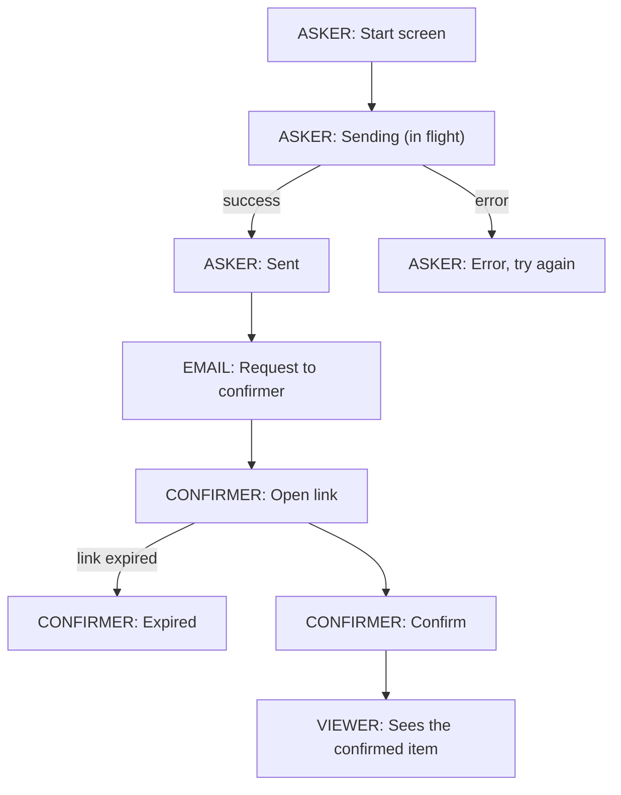

# Process map: [plan name]

> Goes inside the plan (section 5b of a Full PRD, or the Map line of a Lite). Drawn from: [ruling numbers / code paths]. Never from memory.

## The map

## The gate (one line per box)

| Box | What the customer sees | File | Test | Check before merge (Match / Different / Not built, file:line) |
|---|---|---|---|---|
| A1 | | | | |
| A2 | | | | |
| A3 | | | | |
| A4 | | | | |
| E1 | | | | |
| C1 | | | | |
| C2 | | | | |
| C3 | | | | |
| V1 | | | | |

## Checklist before approval

- [ ] Every side is drawn (asker, confirmer, viewer, or whoever takes part)
- [ ] Every screen has its states: loading, in flight, success, error, empty, expired
- [ ] Every email or notification is a box
- [ ] Every box names its ruling or its code path
- [ ] Every box has a file and a test in the gate
- [ ] Approved by [owner], by name, ruling [#], [date]
